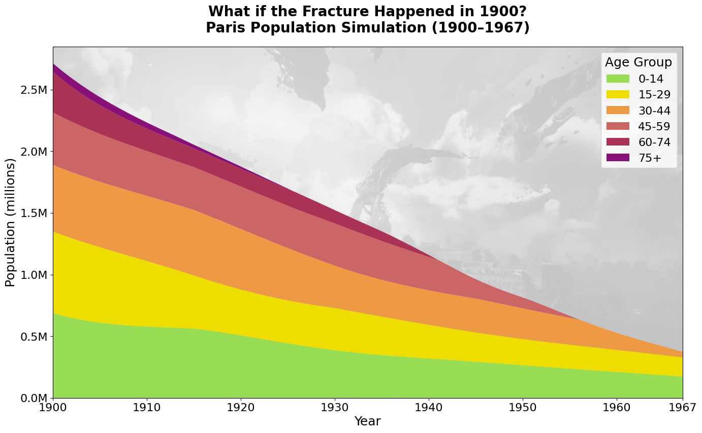

# What if the Fracture Happened in 1900?

Inspired by [*Clair Obscur: Expedition 33*](https://www.expedition33.com/).

Each year, a mysterious ritual causes the disappearance of the city's oldest remaining age group. In 1900, all 100-year-olds vanish. In 1901, all 99-year-olds. This continues until, in 1967, those aged 33 are taken.
The simulation offers a glimpse into how the city's demographics might have evolved under this unusual pattern.

## Methodology & Sources

- **Initial population** based on the 1901 French census and scaled to match the 1901 Paris population (~2.7 million).
- **Fertility and mortality rates** by age are based on historical French data from 1901, using a TFR of 2.89
- **The Paintress effect** removes one age group per year, starting from age 100 in 1900 down to 33 in 1967.

Source: https://www.bnsp.insee.fr/ark:/12148/bpt6k5503095m/f56.item.zoom